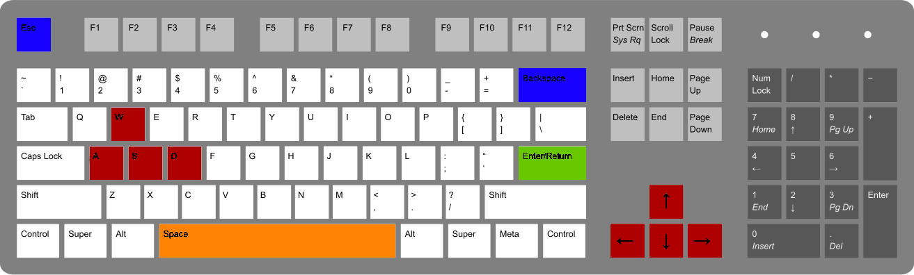

# J.A.A.G 
#### (Just Another Adventure Game [not yet])

## Game Controls

-  Move your character!
-  Roll your character!
-  Attack!
-  Pause!

## Features that we have implemented
- Move and slide
- Collisions
- Attack
- Effects on attack

## To Do 
- [X] AI enemies
- [X] Life Bar
- [X] Animate character and enemies
- [X] Main Menu
- [X] Pause Menu
- [X] Multiple Levels

## Known Bugs

- [X] When the game starts the roll direction is wrong
- [X] Bat doesn't stop moving.
- [ ] Sometimes the enemy does not have damage upon you
